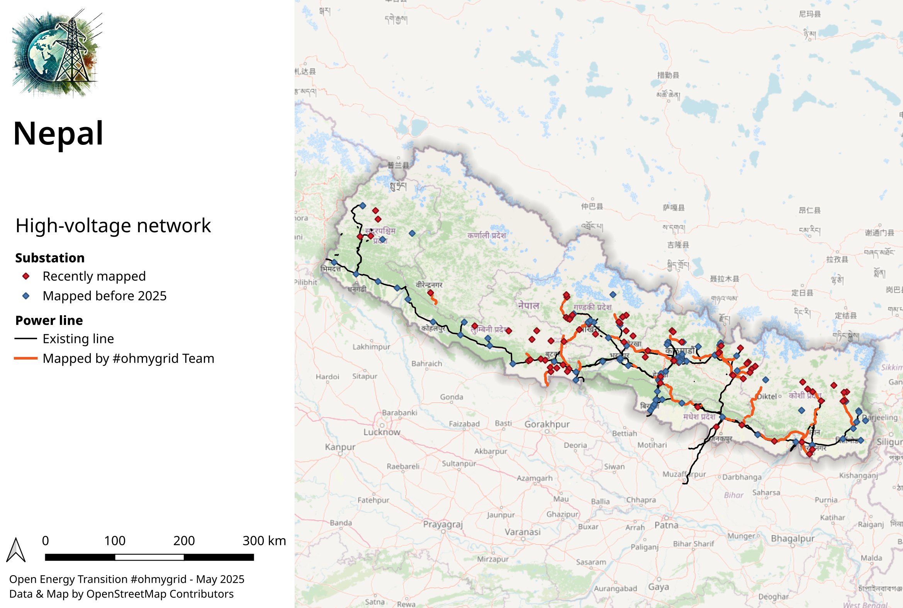

# osm-power-grid-map-analysis
To build maps and graph analysis on OpenStreetMap (OSM) power grid data (power lines and substations).

This repository contains 2 elements :

* Three python scripts that 1) downloads data from OSM via Overpass for a given country ; 2) cleans and prepares it for building a graph ; 3) Builds and analyses a graph
* A QGIS project to render this data with 1) A map showing high-voltage network on OSM and recent contributions especially through the project #ohmygrid ; 2) A map showing basic grid consistency.

See below result examples for Nepal.

## Configure python script

* Install the python dependancies via pip (pandas, geopandas, networkx, requests, osm2geojson, shapely ...)
* Set the desired two-letters COUNTRY_CODE in each script
* Set the desired BUFFER_DISTANCE (in meters) in script 2. This buffer is drawn auround substation to catch all power lines ending around. BUFFER_DISTANCE should be ideally 0, but in practise, we may need some tolerance.
* Run the scripts in the order.

## Configure QGIS project

* Open qgis project of this repository
* Go to Project / Properties / Variable and set the `country_name` variable.
* Import all produced files by the python scripts (by default in data foleder) into QGIS except `pre_graph_power_lines.gpkg`. Duplicate `osm_brut_country_shape` layer into QGIS.
* Copy/paste style from the existing layers, e.g. from Bolivia (BO), to the new layers of the same name - (right-click on a layer / Styles / Copy Style / All categories ; thus paste on imported layer)
* In the layer selection, disable all layers that are not concerning the country you work on. Disable, do not remove them ! Especially `Graph` & `Map` layer groups must stay as they are used for building the map legend !

The QGIS project may help to produce two map template (see example for Nepal above).

* For the high-voltage network map, you need to enable only the following layers for :
    * pre_graph_power_nodes
    * osm_brut_power_tower_transition
    * osm_brut_power_line
    * both osm_brut_country_shape
* For the grid connectivity map, you need to enable only the following layers :
    * post_graph_power_nodes
    * post_graph_power_lines
    * both osm_brut_country_shape 
  
  
