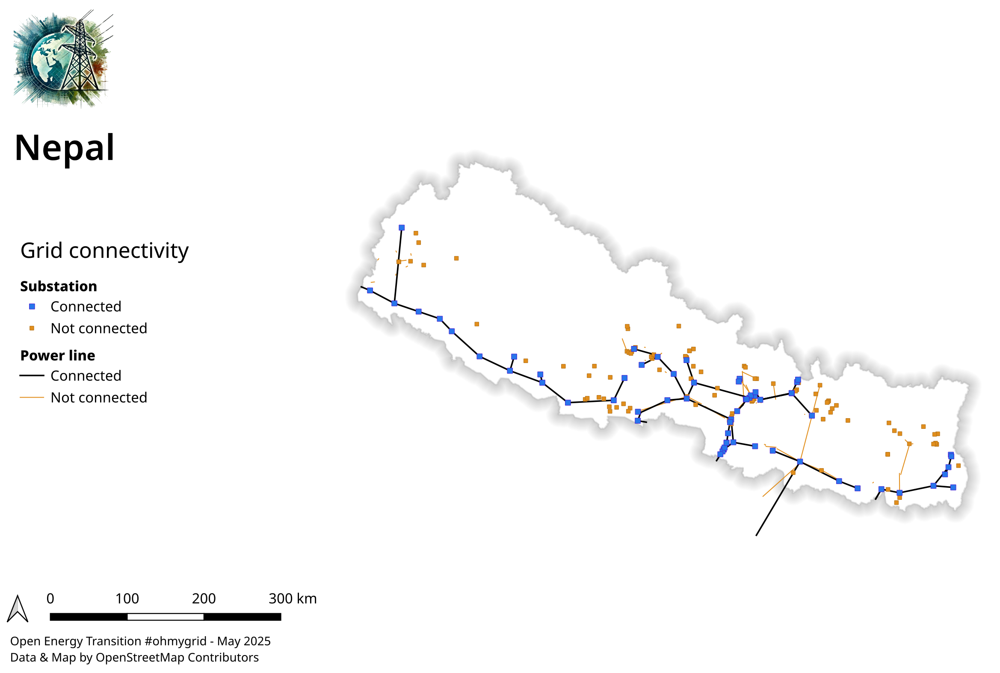

# osm-power-grid-map-analysis
To build maps and graph analysis on OpenStreetMap (OSM) power grid data (power lines and substations).

This repository contains 2 elements :

* Three python scripts that 1) downloads data from OSM via Overpass for a given country ; 2) cleans and prepares it for building a graph ; 3) Builds and analyses a graph
* A QGIS project to render this data with 1) A map showing high-voltage network on OSM and recent contributions especially through the project #ohmygrid ; 2) A map showing basic grid consistency.

See below result examples for Nepal.

## Configure and run python scripts

* Install the python dependancies listed in requirements.txt : `pip install -r requirements.txt`.
* Set the desired two-letters COUNTRY_CODE in each script.
* Set the desired BUFFER_DISTANCE (in meters) in script 2. This buffer is drawn auround substation to catch all power lines ending around. BUFFER_DISTANCE should be ideally 0, but in practise, we may need some tolerance.
* Run the scripts in the order.

## Configure and export QGIS project

* If it is not yet done, download and install QGIS : https://qgis.org/download/ (if you are not familiar with QGIS, choose the Long Term Release, it is supposed to be more stable)
* Open the QGIS project file of this repository
* Go to Project / Properties / Variable and set the `country_name` variable.
* Import all produced files by the python scripts (by default in data folder) into QGIS except pre_graph_power_lines.gpkg which is not needed.
* Copy/paste style from the existing layers, e.g. from Bolivia (BO), to the new layers with the same name - (right-click on a layer / Styles / Copy Style / All categories ; thus paste on imported layer)
* In the layer selection, disable all layers that are not concerning the country you work on. Disable, do not remove them ! Especially `Graph` & `Map` layer groups must stay as they are used for building the map legend !

The QGIS project may help to produce two map templates (see example for Nepal above).

* For the high-voltage network map, you need to enable only the following layers :
    * pre_graph_power_nodes
    * osm_brut_power_tower_transition
    * osm_brut_power_line
    * osm_brut_country_shape
    * OpenStreetMap
* For the grid connectivity map, you need to enable only the following layers :
    * post_graph_power_nodes
    * post_graph_power_lines
    * osm_brut_country_shape

Once the right layers are enable:

* Go to menu Projects / Layout / Standard.
* In the Elements list, choose the map legend associated to one of the two templates. Disable the other map legend.
* Move and zoom/unzoom the map to the desired country with the Move Item Content button : 
* Export your map in the desired format the menu Layout / Export as image, PDF ... . Be careful to not export as vectorized format if OpenStreetMap background layer is enable.

